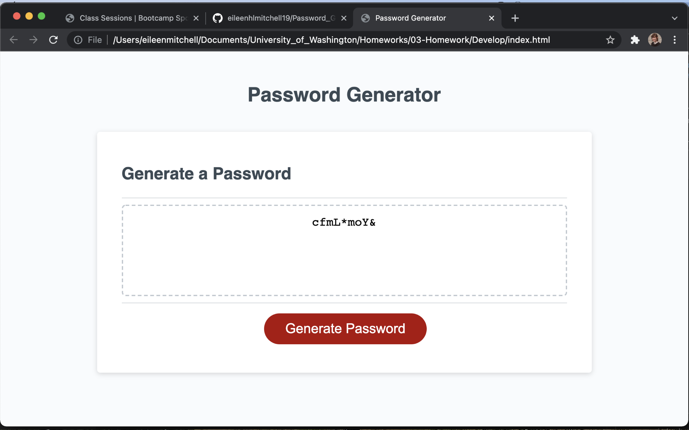
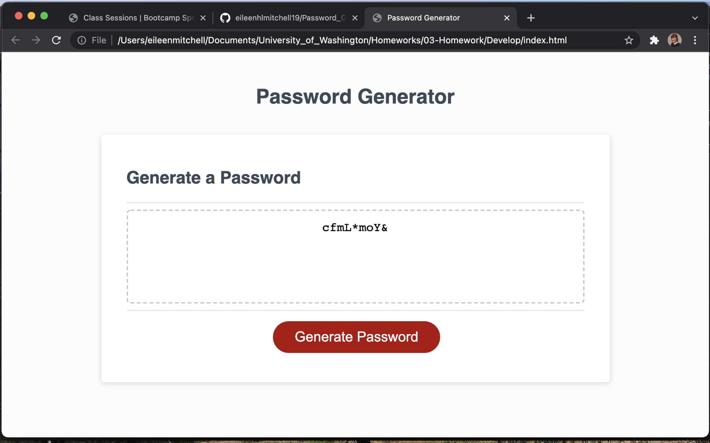

# PASSWORD GENERATOR 
By: Eileen Mitchell

-AN INTERACTIVE RANDOMIZED PASSWORD GENERATOR

# Github Repo

https://github.com/eileenhlmitchell19/Password_Generation_Javascript_Basics

# Website Link

https://eileenhlmitchell19.github.io/Password_Generation_Javascript_Basics/

# Technologies Used

-HTML
-CSS
-JAVASCRIPT

# Description

This website allows users to select a password based off of various prompts that help the user determine what types of letters, numbers and characters they would like to be included. After the user determines these values, a randomized password is created for the user.

In order to determine your password, click on "Generate Password". A prompt will appear for you to select the length of your password. If an innappropriate value is selected, the application will be restarted. Various other prompts will appear for the user to select uppercase or lowercase letters, numbers or other values before receiving the finished password.

# Known Bugs
There are no known bugs in the code, however, it takes a while for some of the prompts to load and move you on to the next question. It would also be convenient for the question to be asked directly, but the page is clean and this is a usable password generator.

# Links

